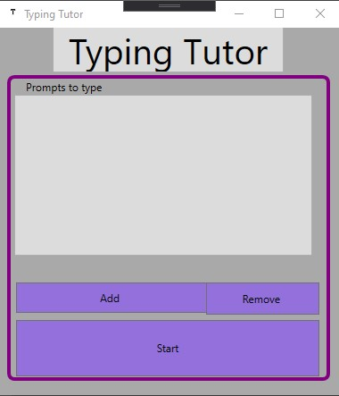
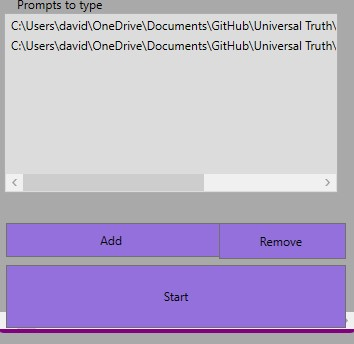
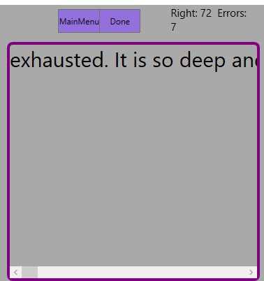
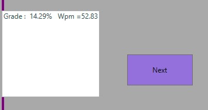

# Introduction to Typing-Tutor

Test your words per minute and accuracy using this simple Windows presentation foundation project. This program allows the user to select txt files they want to type instead of giving boring premade prompts, Type the Illiad, the dictionary, or a novel and have that file save for future typing. This is a C# typing test project using the Windows WPF UI framework and the file management class in C#. 

##  Features

* Keyboard Input 
* WPM and accuracy calculation by timing the user and dividing the amount of time a wpm and grade is calculated 
* Custom Entries The File class allows users to find text files on their device use them within the project and saves the files. 

###  Product Presentation

* Promts to write a list of all available text files the user has added
* Add opens the file selection window when the file is selected it will be added to the prompt display(please pick only a .txt file)
* Remove removes selected item from the list (must have a file selected)
* Start starts the typing tutor (if no item is selected a random text prompt will be chosen otherwise the selected file will be the prompt)

This is what it will look like when files are added. 
They will be titled the file's path. You can add as many files as you want.

This is what typing looks like, each character will be removed as the correct key is entered.

When the user clicks done or the prompt is finished the grading menu opens showing the words per minute and accuracy.
if next is clicked a random file from the prompts will be selected(if there is only one prompt it will be selected automatically though if there is more than one they will not repeat themselves)
